# Manabi LMS — 動画学習プラットフォーム

転職ポートフォリオ用の動画学習プラットフォーム(LMS)デモアプリケーション。
企業研修向けに「管理者が講座を割り当て、受講者がYouTube動画で学習し、進捗を記録する」流れを実装する。

**🌐 公開URL: https://manabi-lms.vercel.app**

> **ステータス: MVP完成(チェックリスト Session 1〜10 完了)**
> 認証(Auth.js + bcrypt)・DB(Neon + Prisma)・進捗記録(Server Actions)・
> 管理CRUD(講座/カリキュラム/受講者/割り当て)まで全機能がDB接続で動作し、
> Vercel本番環境にデプロイ済み。

## スクリーンショット

| 受講者: 講座一覧 | 講座詳細 |
|---|---|
| 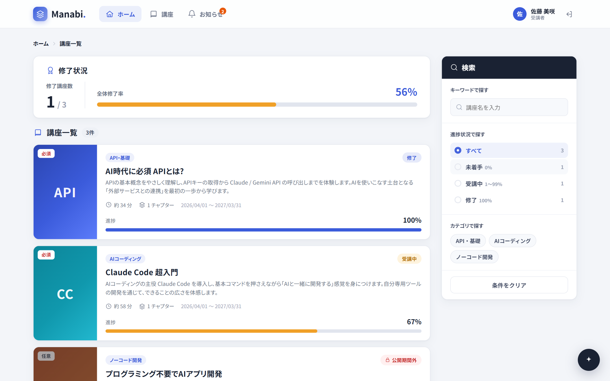 | 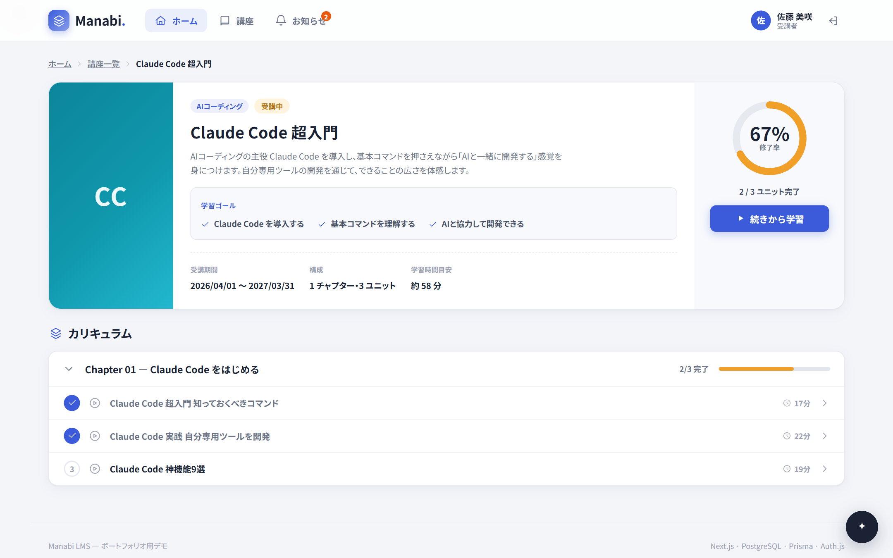 |

| 動画視聴・完了ボタン | 管理: 進捗ダッシュボード |
|---|---|
|  | 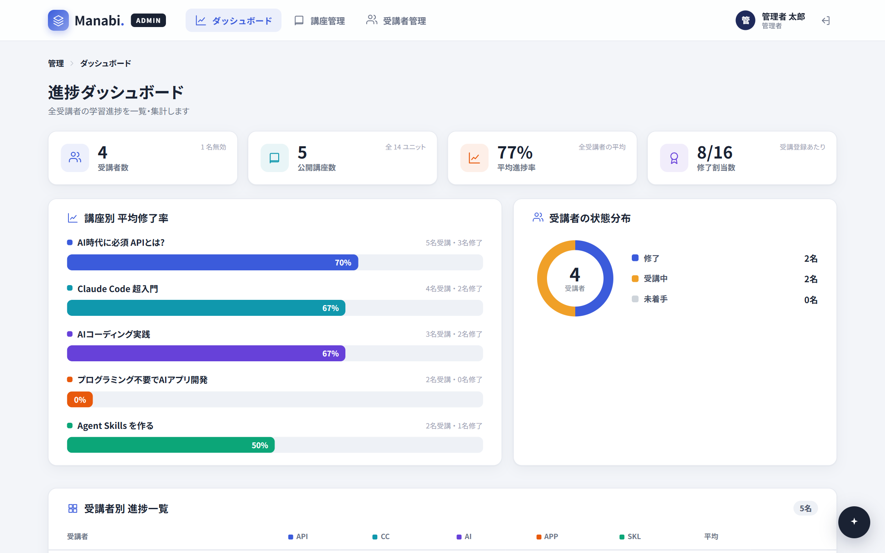 |

| ログイン | 管理: 講座割り当て |
|---|---|
| 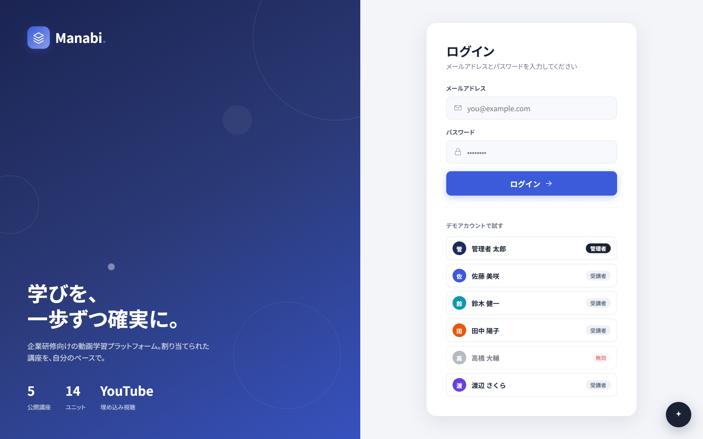 | 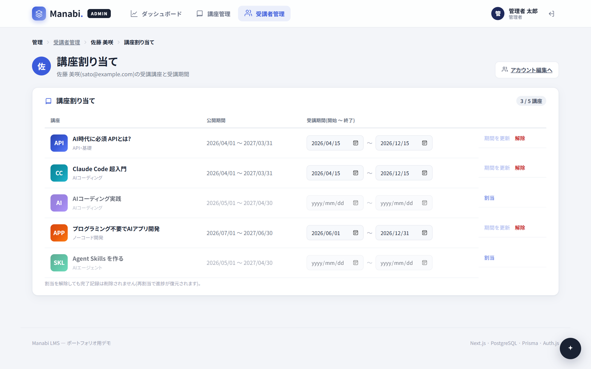 |

### モバイル表示(レスポンシブ対応)

720px以下ではハンバーガーメニュー・検索の折りたたみ・縦積みレイアウトに切り替わる。

| ログイン | 講座一覧 | 動画視聴 | 管理ダッシュボード |
|---|---|---|---|
| 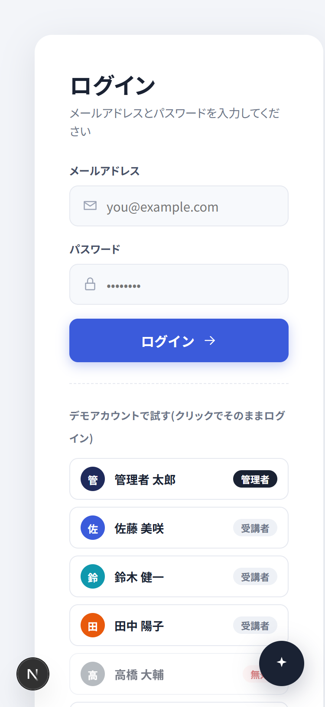 | 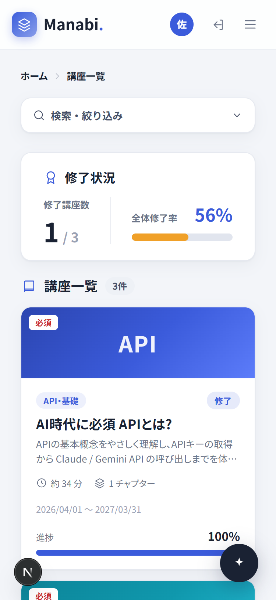 | 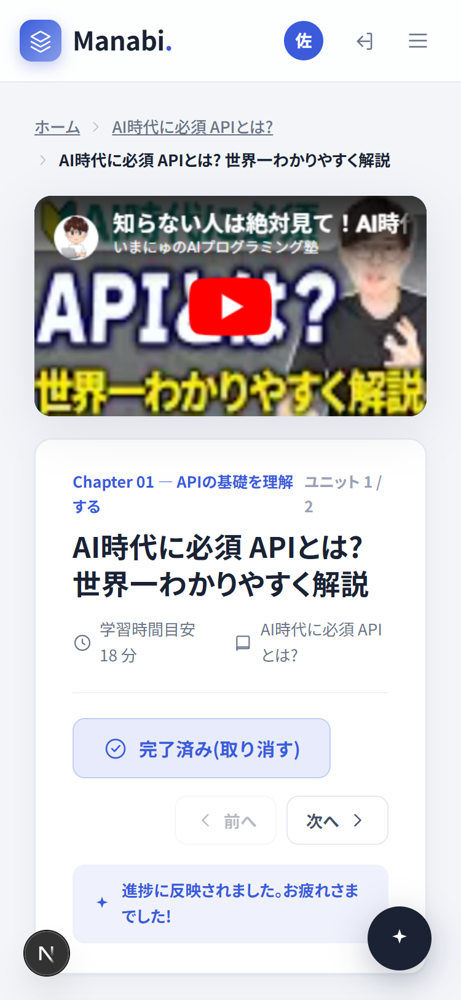 | 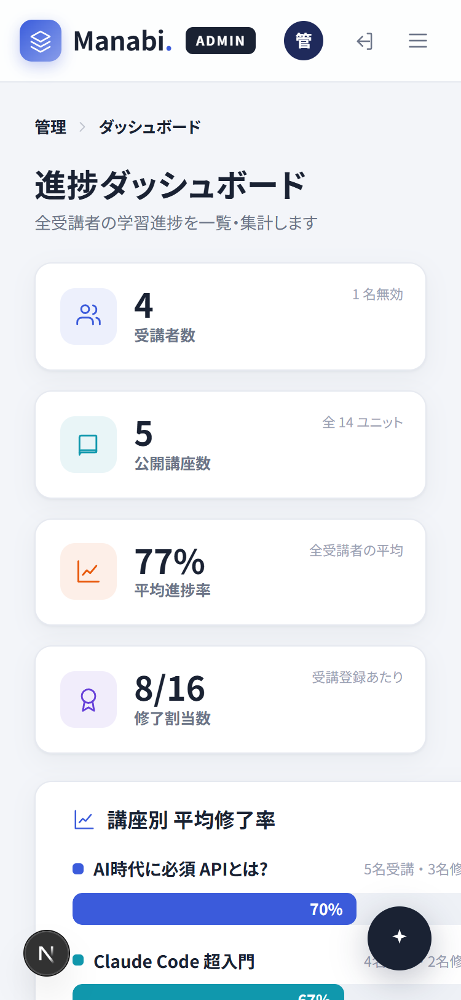 |

スクリーンショットは `node scripts/capture-screenshots.mjs` で自動撮影(puppeteer-core)。

## 技術構成

| 項目 | 採用技術 |
|---|---|
| フレームワーク | Next.js (App Router) / TypeScript / React 19(Server Components + Server Actions) |
| データベース | Neon (PostgreSQL 17)。`main`=本番 / `development`=開発でブランチ分離 |
| ORM | Prisma v6(スキーマ = 設計ドキュメント、マイグレーション管理) |
| 認証 | Auth.js v5 Credentials Provider + bcrypt。JWTにロール格納、proxy(旧middleware)でアクセス制御 |
| スタイリング | グローバルCSS(デザイントークン + CSS変数。Claude Designプロトタイプから移植) |
| フォント | Noto Sans JP / Zen Kaku Gothic New / Outfit (`next/font/google`) |
| 動画 | YouTube 埋め込み(youtube-nocookie.com) |
| テスト | Vitest(期間判定・進捗集計の純粋関数 + 認可ロジックのユニットテスト) |
| CI | GitHub Actions(push/PRごとに lint → 型チェック → テスト → 本番ビルドを自動実行) |
| ホスティング | Vercel(本番: Neon `main` ブランチ / ローカル開発: `development` ブランチ) |

## 技術選定の理由

| 技術 | なぜ選んだか |
|---|---|
| **Next.js App Router + Server Components** | 認証・DBアクセス・画面描画をサーバー側で完結でき、APIサーバーを別に立てる構成より小規模チーム向けに工数効率が良い。Server Actions でフォーム送信からDB更新までを型安全につなげられる |
| **Auth.js v5 Credentials** | 認証の自前実装はセキュリティ事故のもとなので標準ライブラリを採用。パスワードは bcrypt でハッシュ化し、JWTにロールを格納してアクセス制御に使う |
| **Neon PostgreSQL + Prisma v6** | 素のRDBで多対多(受講者×講座×ユニット)のテーブル設計を自分で行うため。Neonのブランチ機能で開発用DBと本番DBを分離し、開発中の誤操作から本番データを守る。Prismaはv7が破壊的変更を多く含むため、安定したv6を意図的に採用 |
| **Tailwind不使用(素のCSS+デザイントークン)** | デザインプロトタイプ(Claude Design)から移植したクラス名・トークンをそのまま活かすため。CSS変数による一元管理で、Tweaksパネルからのテーマ切り替えも実現 |
| **Vitest** | 一番事故ってはいけない「期間判定」と「認可」を高速なユニットテストで保護するため |

## システム構成

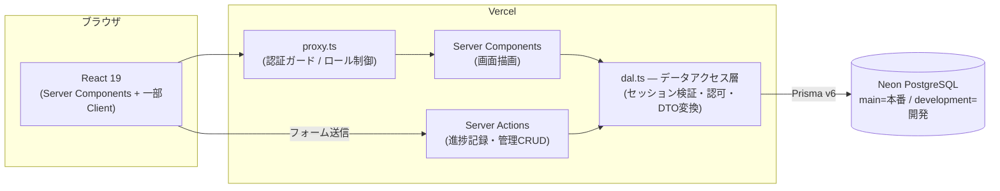

データの流れの要点: クライアントから直接DBに触る経路はなく、**すべて `dal.ts` を経由**する。
認可チェック(セッション検証・ロール・講座の割当)はこの層とServer Actions側で二重に行い、
クライアント側のボタン制御には依存しない。

## 起動方法

```bash
npm install
cp .env.example .env     # 見本をコピーし、DATABASE_URL と AUTH_SECRET を設定
npx prisma migrate dev   # テーブル作成
npm run seed             # デモデータ投入(再実行可能)
npm run dev
# → http://localhost:3000
```

## 品質チェック

```bash
npm run lint        # ESLint
npm run typecheck   # TypeScript 型チェック(tsc --noEmit)
npm test            # ユニットテスト(Vitest)
npm run build       # 本番ビルド(型エラーで失敗する)
```

同じチェックを GitHub Actions(`.github/workflows/ci.yml`)が push / Pull Request ごとに自動実行する。

テストが守っている範囲:

- **期間判定・進捗集計**(`src/lib/access.test.ts`)— 公開期間/受講期間の境界値(開始日・終了日当日を含む)をJST基準で検証
- **認可**(`src/lib/dal.test.ts` / `src/app/actions.test.ts`)— 「割り当てられていない講座は直URLでも閲覧・操作できない」「受講者セッションでは管理操作を実行できない」「期間外は完了記録を拒否する」ことを検証

## デモアカウント

ログイン画面の「デモアカウントで試す」から選択可能(共通パスワード: `demo-pass`、ボタンで自動入力)。

| アカウント | メール | 状態 |
|---|---|---|
| 管理者 太郎(管理者) | admin@example.com | ダッシュボード・講座管理・受講者管理 |
| 佐藤 美咲 | sato@example.com | 講座1修了・講座2受講中・講座4は公開期間外 |
| 鈴木 健一 | suzuki@example.com | 講座1〜3修了 |
| 田中 陽子 | tanaka@example.com | 受講期間終了(受講期間外バッジのデモ) |
| 高橋 大輔 | takahashi@example.com | 無効アカウント(ログイン拒否のデモ) |
| 渡辺 さくら | watanabe@example.com | 全講座修了 |

## 画面構成

| パス | 画面 | ロール |
|---|---|---|
| `/login` | ログイン(デモアカウント選択付き) | 共通 |
| `/` | 講座一覧 + 修了サマリー + 検索・絞り込み(URLクエリ保持) | 受講者 |
| `/courses/[id]` | 講座詳細(チャプター → ユニット階層・進捗リング) | 受講者 |
| `/courses/[id]/units/[unitId]` | 動画視聴 + 完了ボタン | 受講者 |
| `/admin` | 進捗ダッシュボード(KPI・講座別修了率・進捗マトリクス) | 管理者 |
| `/admin/courses` | 講座管理(CRUDは次フェーズで実体化) | 管理者 |
| `/admin/users` | 受講者管理 + なりすまし(受講画面表示) | 管理者 |

その他: 公開期間外・受講期間外講座のロック表示(ERR-07/08)、右下のTweaksパネルで
ブランドカラー・講座一覧レイアウト・余白密度を切り替え可能。

## ER図

「受講者 × 講座」の割り当ては Enrollment(受講期間つき)、「受講者 × ユニット」の完了は UnitProgress(完了日時つき)の中間テーブルで表現。修了率は UnitProgress から都度集計する(非正規化カラムを持たず整合性を優先)。

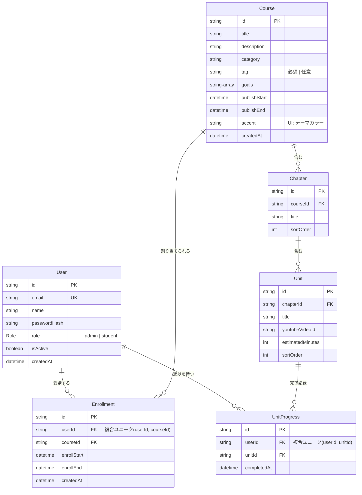

削除時の整合性: Course → Chapter → Unit → UnitProgress / Enrollment はカスケード削除。受講者は物理削除せず `isActive=false` で無効化(進捗を履歴として保持)。

## 設計メモ

- `prisma/schema.prisma` — ER図準拠の6テーブル。複合ユニーク制約(二重割当・二重完了防止)とカスケード削除方針
- `prisma/seed.ts` — `src/lib/data.ts` のデモデータを単一の真実としてDBへ投入(冪等)
- `src/lib/dal.ts` — データアクセス層。セッション検証・なりすまし解決(httpOnly Cookie)・DTO組み立てをサーバー側で実施
- `src/app/actions.ts` — Server Actions(完了トグル・なりすまし)。認可と期間チェックをサーバー側で必ず検証
- `src/lib/access.ts` — 公開期間/受講期間判定・進捗率計算の純粋関数(Vitestでテスト)。判定は日本時間の実日付ベースで、開始日・終了日は当日を含む(※当初はデモ用に基準日を固定していたが、実運用に合わせて現在日時判定に変更)
- `src/auth.ts` / `src/auth.config.ts` — Auth.js本体とedge対応共通設定の分離(proxyからPrismaを参照しないため)
- Tweaksパネル(配色等)のみ意図的にlocalStorage(ユーザー個人のデザイン検討用設定のため)

要件定義書・タスクチェックリストはプロジェクト資料フォルダ(`動画学習プラットフォーム_ダッシュボードLMS/`)を参照。

## このプロジェクトで習得したこと

1. **多対多リレーションのDB設計** — 「受講者×講座」は受講期間を持つ `Enrollment`、「受講者×ユニット」は完了日時を持つ `UnitProgress` という2つの中間テーブルで表現。複合ユニーク制約で二重割当・二重完了をDBレベルで防止し、修了率は非正規化カラムを持たず都度集計して整合性を優先した(規模が大きくなった場合はマテリアライズドビュー等への移行余地があることも理解した上での判断)
2. **期間判定ロジックの純粋関数化とテスト** — 「公開期間」と「受講期間」の2軸の判定を、日本時間の実日付ベース・両端含むルールで純粋関数に切り出し、境界値を含むユニットテストで保護。タイムゾーンと日付境界のバグがいかに混入しやすいかを学んだ
3. **認可の二重化と「読み取り側の認可漏れ」の怖さ** — ミドルウェアとServer Actions/DALの双方でサーバー側検証を行う設計にしていたが、レビューで「書き込みは拒否するのに、未割当講座の閲覧は直URLで通る」という読み取り側の漏れが見つかった。修正とあわせて再発防止のテストを追加し、「認可はUIに到達経路がなくても、データを返す全経路で検証する」という教訓を得た
4. **UXの言語化と改善** — 「保存したつもりが保存されていない」「並び替えボタンが数値の増減ボタンに見える」など、動作は正しいのに画面が意図を伝えられていない問題を発見し、保存単位の明示・離脱警告・モバイルナビゲーションの追加などで改善した

## ポートフォリオ全体での位置づけ

| プロジェクト | 示すスキル |
|---|---|
| **Manabi LMS(本作)** | フルスタックWeb構築の基礎力 — RDB設計・ロールベース認証/認可・進捗集計ロジック・テスト/CI |
| **在庫予測ダッシュボード(次作・開発中)** | AI/データ分析 — 経理20年の業務知識を活かした需要予測モデルとダッシュボード |

経理(簿記1級・20年)からAI開発へのキャリア転換にあたり、本作は「業務システムを設計から運用まで一人で形にできること」の証明として制作した。
